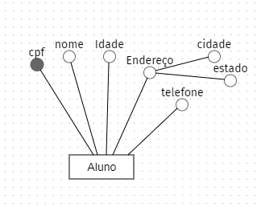

# Banco de dados I - Codepark 2
___

> O desenvolvimento de um projeto de banco de dados passa por fases importantes para a sua implementação, como a de **projeto conceitual**. Diante disso, crie uma entidade que tenha atributos simples, composto e multivalorado.

### Resposta
___

* ##### Atributos simples: 
cpf, nome e idade
* ##### Atributos compostos: 
Endereço
* ##### Atributos multivalorado: 
telefone (pode ser adicionado mais de um)
