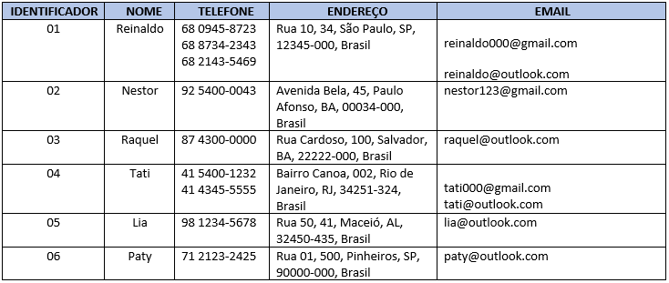

# Banco de dados I - Codepark 3

>A normalização de dados é um processo realizado nas tabelas para evitar anomalias. Com base no conteúdo visto no Hipertexto 3, transforme a tabela em anexo na Primeira Forma Normal (1FN).
>
>Realize essa atividade no WORD ou no Bloco de Notas, suba esse arquivo para algum repositório e compartilhe o link no campo ao lado para que outros desenvolvedores possam analisá-lo.

### Resposta
___
 * Pessoa
                                
| pessoa_id |   nome   |   endereco   | numero |     cidade     |  uf   |    cep    |  pais  |
| :-------: | :------: | :----------: | :----: | :------------: | :---: | :-------: | :----: |
|    01     | Reinaldo |    Rua 10    |   34   |   são Paulo    |  SP   | 12345-000 | Brasil |
|    02     |  Nestor  | Avenida Bela |   45   |  Paulo Afonso  |  BA   | 00034-000 | Brasil |
|    03     |  Raquel  | Rua Cardoso  |  100   |    Salvador    |  BA   | 22222-000 | Brasil |
|    04     |   Tati   | Bairro Canoa |  002   | Rio de Janeiro |  RJ   | 34251-324 | Brasil |
|    05     |   Lia    |    Rua 50    |   41   |     Maceió     |  AL   | 32450-435 | Brasil |
|    06     |   Paty   |    Rua 01    |  500   |   Pinheiros    |  SP   | 90000-000 | Brasil |

* Telefone
  
  | telefone_id | pessoa_id |   telefone   |
  | :---------: | :-------: | :----------: |
  |     01      |    01     | 68 0945-8723 |
  |     03      |    01     | 68 8734-2343 |
  |     04      |    01     | 68 2143-5469 |
  |     05      |    02     | 92 5400-0043 |
  |     06      |    03     | 87 4300-0000 |
  |     07      |    04     | 41 5400-1232 |
  |     08      |    04     | 41 4345-5555 |
  |     09      |    05     | 98 1234-5678 |
  |     10      |    06     | 71 2123-2425 |

* Email
  
  | email_id | pessoa_id |         email         |
  | :------: | :-------: | :-------------------: |
  |    01    |    01     | reinaldo000@gmail.com |
  |    02    |    01     | reinaldo@outlook.com  |
  |    03    |    02     |  nestor123@gmail.com  |
  |    04    |    03     |  raquel@outlook.com   |
  |    05    |    04     |   tati000@gmail.com   |
  |    06    |    04     |   tati@outlook.com    |
  |    07    |    05     |    lia@outlook.com    |
  |    08    |    06     |   paty@outlook.com    |
  