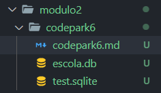
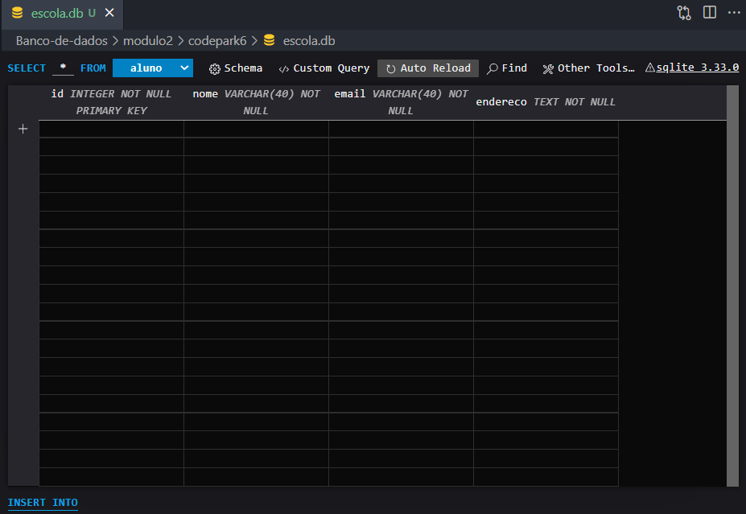

# Banco de dados I - Codepark 6
***
>De acordo com os comandos aprendidos, programe códigos SQL para criar um banco de dados chamado ESCOLA e deixe-o pronto para o uso. Depois, pesquise qual é o comando utilizado para inserir uma tabela no banco de dados e siga as instruções:

>1. crie uma tabela chamada ALUNO;  
>2. defina os atributos da tabela;
>3. adicione a chave primária de nome ID (identificador);
>4. adicione um atributo nome do tipo varchar;
>5. adicione um atributo e-mail do tipo varchar;
>6. adicione um atributo endereço do tipo varchar.

#### Resposta
***
Teve dificuldades em ultilizar o MySql Workbench, então utilizei o Sqlite que é um SGDB simples muito utilizado em aparelhos eletronicos e mobile. 

No VScode, utilizei as extensões [SQLite](https://marketplace.visualstudio.com/items?itemName=alexcvzz.vscode-sqlite)  e a [SQLite3 Editor](https://marketplace.visualstudio.com/items?itemName=yy0931.vscode-sqlite3-editor) (Gostei mais da SQLite3).


Por ser simple, ele não compõe a syntax "DATABASE", então o arquivo `.db` ou `.sqlite` deverá ser criado manualmente. 



* 1. crie uma tabela chamada ALUNO;
* 2. defina os atributos da tabela;
* 3. adicione a chave primária de nome ID (identificador);

Para criar uma tabela precisar possui pelo menos um atributo, então adicionei o "id" como o atributo e já como `PRIMARY KEY` e para auto incrementar 

```
CREATE TABLE aluno(
   id INTEGER PRIMARY KEY AUTOINCREMENT NOT NULL 
);
```
* 4. adicione um atributo nome do tipo varchar;

```
ALTER TABLE aluno ADD COLUMN nome VARCHAR(40) NOT NULL;
```

* 5. adicione um atributo e-mail do tipo varchar;

```
ALTER TABLE aluno ADD COLUMN email VARCHAR(40) NOT NULL;
```
* 6. adicione um atributo endereço do tipo varchar.

```
ALTER TABLE aluno ADD COLUMN endereco TEXT NOT NULL;
```
##### Resultado final





***

Caso dejese ultilizar pelo o terminal, veja esse artigo abaixo cliquando no link.

[SQLite: da instalação até sua primeira tabela - Alura](https://www.alura.com.br/artigos/sqlite-da-instalacao-ate-primeira-tabela)