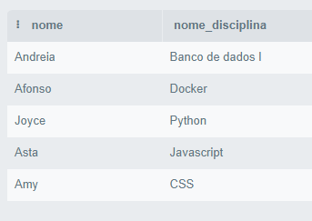
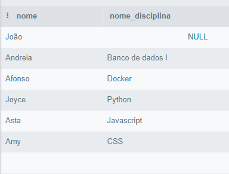
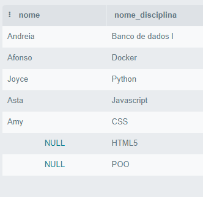
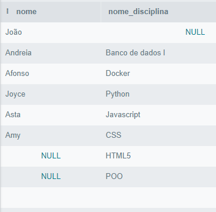

# Banco de dados I - Codepark 2
***

>Desenvolva um banco de dados e relacione tabelas através de chaves estrangeiras ou nomes de colunas iguais. Siga as instruções:
>crie uma base de dados; 
>crie tabelas nessa base de dados;
>em cada tabela, adicione atributos;
>insira dados em cada tabela;
>utilize os comandos Joins para realizar consultas nas tabelas. 

#### Resposta
***

- crie uma base de dados; 

```
CREATE DATABASE escola;
```
- crie tabelas nessa base de dados;
- em cada tabela, adicione atributos;

```
create table disciplinas(
id_disciplina int AUTO_INCREMENT PRIMARY key not NULL,
  nome_disciplina varchar(40) not null,
  nome_professor varchar(40) not null
);

create table alunos(
  id_aluno int  AUTO_INCREMENT PRIMARY key not NULL,
  nome varchar(40) not null,
  disciplina_id int,
  CONSTRAINT FOREIGN key(disciplina_id) REFERENCES disciplinas(id_disciplina)
  );
```

- insira dados em cada tabela;
```
INSERT into disciplinas(nome_disciplina, nome_professor)
values('Javascript', "Ana Maria"), 
('Python', 'Bruno Rocha'), 
('HTML5','Guanabara'),
('CSS', 'Carol'),
('Banco de dados I', 'Boson'),
('Docker', 'Jeferson'),
("POO", "Guanabara");

INSERT into alunos(nome, disciplina_id)
values('João', null),
('Andreia', (SELECT id_disciplina from disciplinas WHERE nome_disciplina = 'Banco de dados I')),
('Afonso', (SELECT id_disciplina from disciplinas WHERE nome_disciplina = 'Docker')),
('Joyce', (SELECT id_disciplina from disciplinas WHERE nome_disciplina = 'Python')),
('Asta', (SELECT id_disciplina from disciplinas WHERE nome_disciplina = 'Javascript')),
('Amy', (SELECT id_disciplina from disciplinas WHERE nome_disciplina = 'CSS'));
```
- utilize os comandos Joins para realizar consultas nas tabelas.

```
select nome, nome_disciplina from alunos
inner join disciplinas 
on disciplinas.id_disciplina = alunos.disciplina_id;
```


```
select nome, nome_disciplina from alunos
left join disciplinas 
on disciplinas.id_disciplina = alunos.disciplina_id;
```


```
select nome, nome_disciplina from alunos
right join disciplinas 
on disciplinas.id_disciplina = alunos.disciplina_id;
```


```
select nome, nome_disciplina from alunos
left join disciplinas 
on disciplinas.id_disciplina = alunos.disciplina_id
UNION
select nome, nome_disciplina from alunos
right join disciplinas 
on disciplinas.id_disciplina = alunos.disciplina_id;
```

