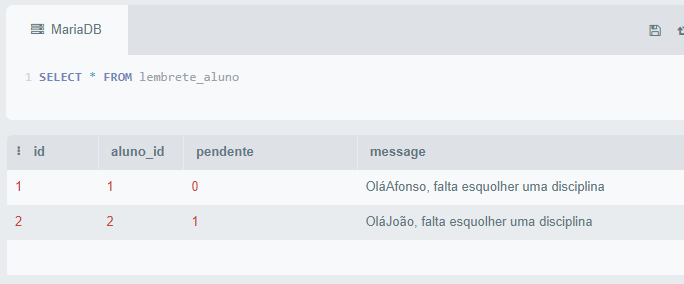

# Banco de dados II - Codepark 2
***

>Crie um banco de dados, adicione tabelas e determine quais são os atributos de cada uma. Em seguida, execute um trigger que se relacione com algum comando, como insert, select, delete ou update.

#### Resposta
***

```
create table disciplinas(
id_disciplina int AUTO_INCREMENT PRIMARY key not NULL,
  nome_professor varchar(40) not null,
  nome_disciplina varchar(40) not null
);

create table alunos(
  id_aluno int  AUTO_INCREMENT PRIMARY key not NULL,
  nome varchar(40) not null,
  disciplina_id int,
  CONSTRAINT fk_id_disciplina
  FOREIGN key(disciplina_id) 
  REFERENCES disciplinas(id_disciplina)
  );

create table lembrete_aluno(
  id int AUTO_INCREMENT primary key,
  aluno_id int,
  pendente bool,
  message varchar(500),
  constraint fk_id_aluno
  foreign key (aluno_id)
  references alunos (id_aluno)
  );
```
```
INSERT into disciplinas(nome_disciplina, nome_professor)
values('Javascript', "Ana Maria"), 
('Python', 'Bruno Rocha'), 
('HTML5','Guanabara'),
('CSS', 'Carol'),
('Banco de dados I', 'Boson'),
('Docker', 'Jeferson'),
("POO", "Guanabara");
```

```
DELIMITER //

CREATE TRIGGER trg_lembrete 
AFTER INSERT ON alunos 
FOR EACH ROW
BEGIN
IF NEW.disciplina_id IS NULL THEN 
INSERT INTO lembrete_aluno(aluno_id, pendente,message)
VALUES(NEW.id_aluno, 1, concat("Olá ", NEW.nome, ", falta esquolher uma disciplina"));
END IF;
END;

CREATE TRIGGER trg_lembrete2
AFTER UPDATE ON alunos 
FOR EACH ROW
BEGIN
IF NEW.disciplina_id IS NOT NULL THEN 
UPDATE lembrete_aluno SET pendente = 0
WHERE aluno_id = NEW.id_aluno;
END IF;
END;
//

DELIMITER ;
```

```
INSERT into alunos(nome, disciplina_id)
values('Afonso', null),
('João', null),
('Andreia', (SELECT id_disciplina from disciplinas WHERE nome_disciplina = 'Banco de dados I')),
('Joyce', (SELECT id_disciplina from disciplinas WHERE nome_disciplina = 'Python')),
('Asta', (SELECT id_disciplina from disciplinas WHERE nome_disciplina = 'Javascript')),
('Amy', (SELECT id_disciplina from disciplinas WHERE nome_disciplina = 'CSS'));
```


```
UPDATE alunos SET 
disciplina_id = (SELECT id_disciplina from disciplinas WHERE nome_disciplina = 'Docker')
WHERE nome = 'Afonso';
```




