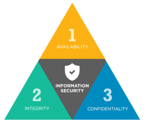

# Banco de dados II - Codepark 5
***
> Após uma varredura rápida no sistema de banco de dados de uma empresa de vendas, identificamos a necessidade de melhorar a segurança dessas informações. Por isso, será necessário desenvolver um novo banco para armazenar os dados mais importantes, como detalhes dos clientes, valores faturados diariamente e informações sobre os produtos, além de outros. Sendo assim, explique quais são os pilares da segurança de dados que devem ser seguidos para que o novo banco seja bem projetado e funcione corretamente

#### Resposta
***

##### Um banco de dados 
é um ambiente onde estão reunidas diversas informações sobre um negócio. Em outras palavras, é um sistema que permite controlar todos os processos de uma empresa, visando entregar um produto de qualidade para os clientes.Esse sistema, naturalmente, é acessado por colaboradores em suas rotinas de trabalho, e para que a segurança em banco de dados não seja comprometida por acidentes ou ameaças intencionais, é preciso garantir o bom funcionamento de três pilares: a __disponibilidade, integridade e confiabilidade__.

 - __Disponibilidade__
A disponibilidade é o princípio de garantir que os dados estarão sempre disponíveis para o uso legítimo. Isso quer dizer que aqueles devidamente autorizados sempre terão acesso ao sistema. 
>
- __Integridade__
Quando falamos em integridade, estamos falando de garantir que as informações manipuladas no sistema permanecerão conservadas em suas características originais. Ou seja, a esse aspecto está diretamente ligado ao controle das mudanças feitas no sistema e toda a preservação do ciclo de vida dos dados, baseado na origem, manutenção e destruição.
>
- __Confiabilidade__
Naturalmente, a confiabilidade significa impor limites de acesso aos dados em questão.Isso quer dizer que nem todos terão acesso a eles, mas sim pessoas confiáveis e que realmente precisem manipular essas informações, inclusive fazendo modificações, se for o caso.