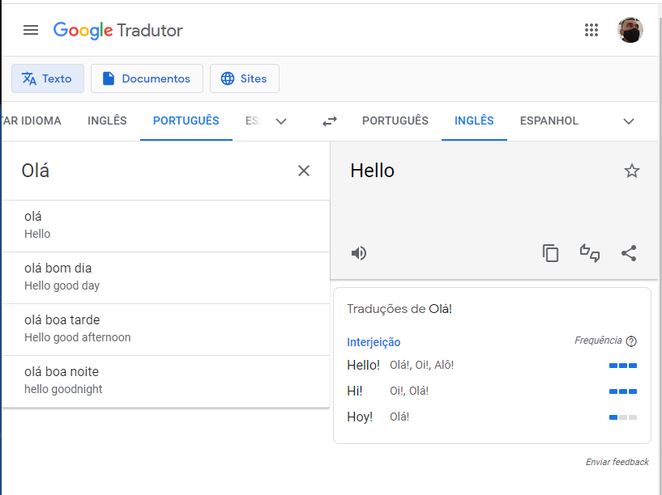

# JavaScript I - AWS
## Modulo 1 - Codepark 1
Tira um print de alguma seção de uma página web na qual você tenha identificado o possível uso do JavaScript para implementar uma funcionalidadeatravés da interação do usuário(em outraspalavras, algo que não daria para fazer apenas com HTML e CSS).

Sem a necessidade de inspecionar o elemento web, descreva da forma mais detalhada possível o comportamento que leva você a acreditar que seria necessário o uso de JS.

---
#### Google Tradutor

[Google Tradutor](https://translate.google.com.br/)

O Google Tradutor pssui varias funções que utilizam o JavaScript. 

Barra de idiomas: Com o _"DETECTAR IDIOMA"_ marcado, o programa tentará reconhecer a o idioma do texto inserido e irá traduzir para o idioma escolhido. 
