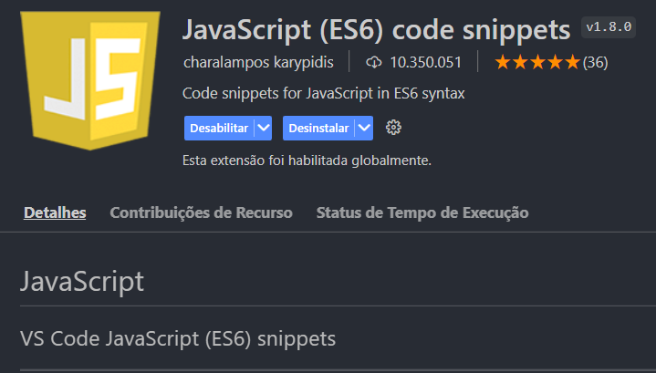

# JavaScript I - AWS
## Modulo 1 - Codepark 2

Pesquise sobre alguma extensão do VSCodeque seja interessante para usar com os conceitos e ferramentas vistos até o momento, e explique porque escolheu ela. Idealmente, procure extensões para facilitar ou automatizar a escrita de arquivos HTML e CSS, porém, pode considerar também o desenvolvimentos de projetos web com VSCode de forma geral, ou a escrita de arquivos JavaScript se se sentir à vontade.

---

#### JavaScript (ES6) code snippets

####

Esta extensão contém trechos de código para JavaScript na sintaxe ES6 para o editor Vs Code (suporta JavaScript e TypeScript).

Esta extensão auxilia o usuario apontando erros de escrita no codigo JavaScript. 